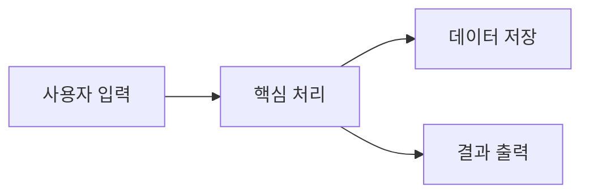

<!--
type: 기능분석 문서 표시용 고정값 (수정 금지)
sources: 분석 대상 코드의 실제 파일 경로 목록. 본문에는 경로를 쓰지 않고 여기에만 적는다
related: 관련 노트(사업 허브/기능분석/개념)의 위키링크 목록. 없으면 []
status: 초안 / 검토완료 중 하나
tags: 분류 태그 목록. 필요 없으면 []
-->

# {{title}}

<!-- 이 기능의 전체 동작을 한눈에 보여주는 다이어그램. 실제 기능에 맞게 교체할 것. -->

## 개요

<!-- 이 기능이 무엇을 하는지, 왜 존재하는지 추상적으로 서술. 실제 파일 경로는 frontmatter sources에만 적는다. -->

## 동작 흐름

<!-- 단계별 동작 흐름을 서술. 텍스트보다 그림이 명확하면 mermaid(sequenceDiagram 등)를 추가한다. mermaid로 복잡한 레이아웃은 SVG로 그려 첨부/다이어그램/에 저장하고 ![[파일명.svg]]로 임베드. -->

## 관련 문서

<!-- 사업 허브, 다른 기능분석/개념 노트의 위키링크 목록. -->
-
